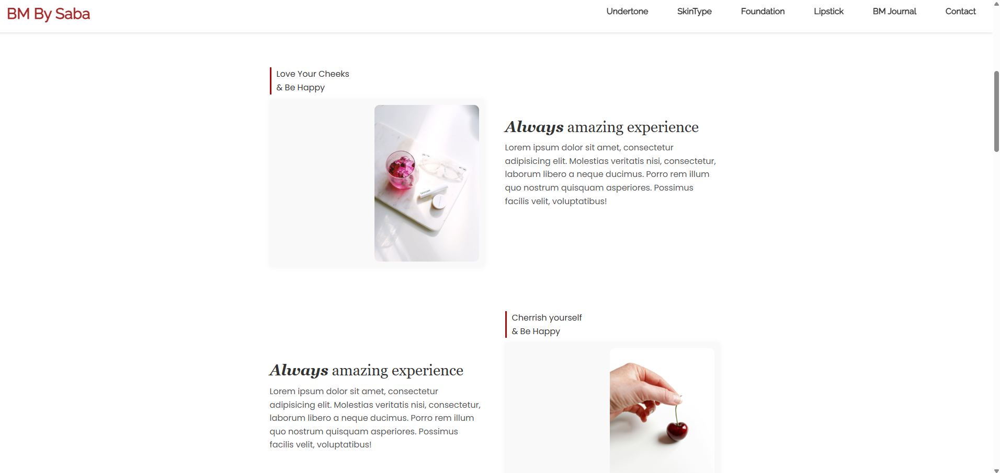
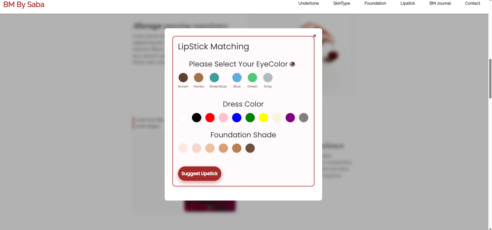

# 💄 BM By Saba

A stylish and responsive beauty website built with HTML, CSS, and JavaScript that helps users discover their perfect lipstick and foundation shades based on their skin undertone and skin type.

## 🌟 Features

- 🧴 **Skin Analyzer Forms**: 
  - Undertone detection
  - Skin type questionnaire
- 💋 **Lipstick Recommender Quiz**: Suggests lipstick shades based on user input.
- 🎨 **Foundation Matcher**: Recommends foundation shades based on the detected undertone.
- 📱 **Fully Responsive Design**:
  - Hamburger menu
  - Smooth scrolling
  - Popup/modal-based interactions
- 📸 **Gallery Section**: Showcase of beauty images and brand vibes.
- ✨ **Animated Elements**: Scroll effects and interactive components.

## 🔧 Tech Stack

- HTML5
- CSS3 (custom styling & responsive layout)
- Vanilla JavaScript (forms, modals, logic handling)

## 📂 Folder Structure

```bash
BM-By-Saba/
├── index.html
├── css/
│   └── style.css
├── js/
│   └── script.js
├── images/
│   └── ...
└── README.md
│   
└── LICENCE

## 📸 Screenshots







git clone https://github.com/YOUR-USERNAME/BM-By-Saba.git

## 📃 License
This project is licensed under the MIT License. See the LICENSE file for details

##  💌 Contact

👩‍💻 Made with ❤️ by Saba Vafaie
Linkdin : Saba Vafaei
Email: vafaiesaba@gmail.com

